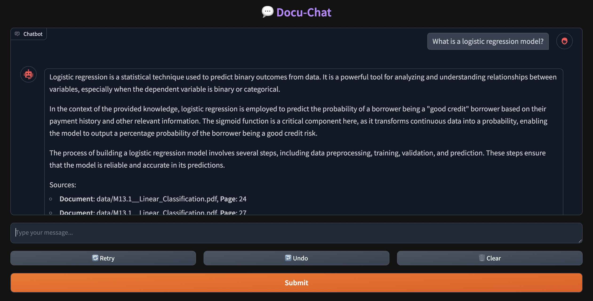

# DocuBot: AI-Powered Document Q&A

## Table of Contents

[Overview](#overview)

[Project Components](#project-components)

[Features](#features)

[Instructions](#instructions)

   -   [Requirements](#requirements)

   -   [Execution](#execution)

   -   [High-level Logic Contained in Notebooks](#high-level-logic-contained-in-notebooks)

[Future Enhancements](#future-enhancements)

[Presentation](#presentation)

[The Team](#the-team)

## Project Overview

### Overview

This project implements a Retrieval-Augmented Generation (RAG) system for AI-driven document processing and chatbot interactions. The system enhances traditional generative AI models by incorporating external knowledge retrieval, allowing for more accurate, contextual, and dynamic responses.

### Project Components

The project consists of three main Jupyter notebooks, each focusing on a different stage of the RAG pipeline:

   1. 01_chatbot_db_builder.ipynb  
      This notebook is responsible for setting up the Retrieval-Augmented Generation (RAG) pipeline using a document database. It includes:

         -   Data Ingestion: Loading and preprocessing documents for indexing.                
         -   Embedding Generation: Using pre-trained models (e.g., OpenAI’s text embeddings, 
         -   Sentence-BERT) to convert documents into vector representations.                
         -   Indexing: Storing embeddings in a vector database such as FAISS, Pinecone, or ChromaDB for efficient retrieval.            
         -   Retrieval Mechanism: Implementing semantic search to fetch relevant documents based on query similarity.            
         -   Testing Retrieval: Running sample queries to validate the retrieval process before integrating with the chatbot.

   2. 02_chatbot_user_interface.ipynb  
      This notebook develops the chatbot that leverages the RAG framework, enabling intelligent responses based on document retrieval. It includes:

         -   Loading the Vector Database: Fetching the pre-indexed embeddings from database_rag.ipynb.            
         -   LLM Integration: Connecting a generative AI model (e.g., OpenAI's GPT-4, Hugging Face models) to generate responses.
         -   Query Processing: Taking user queries, retrieving the most relevant documents, and enhancing the generative model’s response using the retrieved context. 
         -   Interactive Chat Interface: Providing a basic interface for users to interact with the chatbot.    
         -   Evaluation & Fine-tuning: Assessing the chatbot’s responses for relevance and accuracy, with potential refinements to improve performance.

   3. 03_chatbot_model_evaluation.ipynb  
         -   Evaluates chatbot responses for accuracy and relevance.
         -   Measures retrieval effectiveness (e.g., Precision@K, Recall@K).
         -   Assesses LLM output quality using human review and automated scoring metrics.
         -   Suggests improvements to retrieval accuracy and response generation.

### Features
   -   Document Retrieval: Extracts relevant information from a document database using embeddings.
   -   LLM Integration: Utilizes a large language model (LLM) to generate responses.
   -   Semantic Search: Uses vector-based search to improve relevance.
   -   Chatbot Interface: Interactive chatbot designed for document-based queries.
   -   Evaluation Metrics: Measures chatbot accuracy and retrieval effectiveness.

## Instructions

### Requirements
   - Python 3.7+
   - Jupyter Notebook
   - Libraries
        -    os – For handling file paths and environment variables.
        -    dotenv – To manage environment variables from a .env file.
        -    time – For timing operations and delays.
        -    uuid – To generate unique identifiers.
        -    gradio – To create an interactive web-based chatbot interface.
        -    langchain – Core library for building LLM applications.
        -    langchain_community – Additional community-supported integrations for LangChain.
        -    langchain_chroma – For working with ChromaDB as a vector store.
        -    langchain_text_splitters – For handling text chunking and document processing.

### Execution

1. Clone the repository or download the notebooks.

2. Upload documents to the approriate path.

3. Open and execute the database_rag.ipynb notebook.

4. Open and execute the doc_chatbot.ipynb notebook.

5. Open and execute the 03_chatbot_model_evaluation.ipynb notebook.    

### High-level logic contained in notebooks:

#### 1. database_rag.ipynb: Document Processing & Retrieval Setup

   1. Load Environment Variables
        -   Read API keys and configurations using dotenv.

   2. Document Processing
        -   Load raw documents (PDFs, text, or structured data).
        -   Use langchain_text_splitters to break large documents into smaller, meaningful chunks.

   3. Generate Embeddings
       -   Use a pre-trained language model (e.g., OpenAI, Hugging Face) to convert document chunks into vector representations.

   4. Store in a Vector Database
       -   Use langchain_chroma to store embeddings for efficient similarity search.
       -   Assign unique identifiers to each document using uuid.

   5. Test Retrieval Mechanism
      -    Query the database with a sample input.
      -    Use similarity search to retrieve relevant document chunks.
      -    Print retrieved text snippets for validation.

#### 2. doc_chatbot.ipynb: Chatbot with RAG Integration

   1. Load Required Dependencies
      -   Import necessary modules (os, dotenv, langchain, gradio).
      -   Load environment variables (e.g., API keys).

   2. Initialize the Vector Database
      -   Load pre-stored document embeddings from database_rag.ipynb.

   3. Process User Query
      -   Accept user input through a chatbot interface (gradio).
      -   Convert the input into an embedding using the same model as document embeddings.
      -   Retrieve the most relevant document chunks from the vector database.

   4. Generate a Response with RAG
      -   Send the retrieved document context + user query to a large language model (e.g., OpenAI GPT-4).
      -   Generate a response using the LLM, enriched with retrieved document data.

   5. Display Results in a Chat Interface
      -   Format and present the AI-generated response to the user.
      -   Allow users to continue the conversation iteratively.

       

#### 3. 03_chatbot_model_evaluation.ipynb: Model Performance & Evaluation

   1. Load Required Dependencies
      -   Import necessary modules ibraries (langchain, gradio, os, dotenv).
      -   Load the vector database containing stored embeddings.
      -   Set up LLM API keys for response generation.

   2. Define Evaluation Metrics
      -   Establish key performance indicators (KPIs) for chatbot evaluation:
            - Retrieval Effectiveness:
               - Precision@K – Measures how many of the retrieved documents are relevant.
               - Recall@K – Determines how many relevant documents were retrieved.
               - Mean Reciprocal Rank (MRR) – Evaluates the ranking position of relevant results.
            - Response Quality:
               - Relevance Score – Human or automated scoring of response accuracy.
               - Coherence Score – Measures how logically consistent responses are.
               - Fluency Score – Assesses readability and grammar.
               - Hallucination Detection – Identifies whether the chatbot fabricates information.
                 
   3. Generate Test Queries
      -   Create a set of benchmark questions related to the documents stored in the vector database.
      -   Use both manually designed and real user queries.
    
   4. Retrieve Relevant Documents
      -   Use the same retrieval pipeline from 02_chatbot_user_interface.ipynb.
      -   Fetch relevant document snippets based on the test queries.
        
   5. Generate AI Responses
      -   Pass the retrieved context + user query to the LLM (GPT-4, etc.).
      -   Store and compare responses for evaluation.

   6. Score and Compare Results
      -   Evaluate retrieval effectiveness (Precision@K, Recall@K).
      -   Measure response quality using predefined scoring mechanisms.
      -   Compare chatbot responses against gold standard answers (ideal responses).
      -   Compute average scores for various metrics.        

## Future Enhancements
   - Add multi-document summarization for better response synthesis.
   - Improve retrieval accuracy by fine-tuning embedding models.
   - Implement a web-based UI for broader accessibility.
   - Enhance evaluation methods with automated scoring and feedback integration.

## Presentation
[DocuBot: AI-Powered Document Q&A](https://docs.google.com/presentation/d/11ocqx-NdmOseZ2DZvC19bxNAUQ7NzIQlBpVbtEqV-d8/edit?usp=sharing)

## The Team

[cfleming22](https://github.com/cfleming22)

[avineets87](https://github.com/avineets87)

[rjf7q](https://github.com/rjf7q)

[GIBueno25](https://github.com/GIBueno25)

